# Minimal C++ Project

- [System Requirements](#system-requirements)
- [Required programs and packages](#required-programs-and-packages)
- [Optional programs and packages](#optional-programs-and-packages)
- [Install instructions](#install-instructions)
  - [Clone repository](#clone-repository)
  - [Compile the program](#compile-the-program)
  - [Install program](#install-program)
  - [Changing options](#changing-options)
- [Run the program](#run-the-program)
  
# System Requirements
**Minimal Requirements:**

* CPU: multicore processor recommended but not necessary.
* Memory: 8 GiB (32+ GiB recommended for large measurements)
* GPU: CUDA 9.0+ capable with 4+ GiB VRAM

# Required programs and packages
* CMake 3.19+
* C++-17 capable compiler 
* Make

# Optional programs and packages
For testing purposes:
* gcovr
* gcov
* Google Test

# Install instructions
Install all needed dependencies using your package manager or by compiling them from source.

## Setting up the program for execution
The following install instructions are exemplary for Ubuntu 20.04. Please replace `focal` with the code name or your 
Ubuntu distribution. The install instructions may vary based on your system.
### Install dependencies
```bash
apt-get update -qq && apt-get upgrade -y
apt-get install -y apt-transport-https ca-certificates gnupg software-properties-common wget
wget -O - https://apt.kitware.com/keys/kitware-archive-latest.asc 2>/dev/null | gpg --dearmor - | tee /etc/apt/trusted.gpg.d/kitware.gpg >/dev/null
apt-add-repository 'deb https://apt.kitware.com/ubuntu/ focal main'
apt-get update -qq
apt-get install -y gcc g++ cmake make build-essential file git
apt-get install -y libopencv-dev libhdf5-dev libnifti-dev
```

## Setting up the program for development
In addition to the install instructions for the exeuction of PLImg some other packages are needed for tests and documentation.

Example using Ubuntu or Debian:
```bash
sudo apt-get install -y gcc g++ cmake make build-essential file git gcovr libgtest-dev doxygen
sudo cd /usr/src/gtest
sudo cmake CMakeLists.txt
sudo make
sudo cp ./lib/libgtest*.a /usr/lib
cd - 
```

### Clone the project
```bash
git clone git@jugit.fz-juelich.de:j.reuter/plimg.git 
cd plimg
```


## Compile the program
Execute the following commands in the project folder:
```bash
mkdir build
cd build/
cmake ..
make && make test
```

If everything ran successful the generated programs are located at `plimg/build/` and can be started from there.

## Changing options
By default the following options are set:
```
BUILD_TESTING = ON
CMAKE_BUILD_TYPE = Release
CMAKE_INSTALL_PREFIX = /usr/local
```
You are able to change this options with `ccmake` or by defining them when calling `cmake`.

# Run the program
## PLIMaskGeneration
```
PLIMaskGeneration --itra [input-ntransmittance] --iret [input-retardation] --output [output-folder] [[parameters]]
```
### Required Arguments
| Argument      | Function                                                                    |
| ------------------- | --------------------------------------------------------------------------- |
| `--itra`  | One or more normalized transmittance files with the file format `.h5`, `.nii`, `.nii.gz` or `.tiff` |
| `--iret` | One or more retardation files with the file format `.h5`, `.nii`, `.nii.gz` or `.tiff` |
| `-o, --output` | Output folder for mask and median10NTransmittance, if generated. |

### Optional Arguments
| Argument      | Function                                                                    |
| -------------- | --------------------------------------------------------------------------- |
| `--dataset` | Read and write from/to the given dataset instead of `/Image` |
| `--ttra`  | Transmittance threshold. This threshold is near `tMin` and will be set to the point of maximum curvature between `tMin` and `tMax` |
| `--tret` | Set the point of maximum curvature in the retardation histogram |
| `--tmin` | Set the mean value of the transmittance in a connected region of the largest retardation values |
| `--tmax` | Set the point of maximum curvature near the absolute maximum in the transmittance histogram |
| `--detailed` | Using this parameter will add two more parameter maps to the output file. This will include a full mask of both the white and gray matter as well as a mask showing an appoximation of regions without any nerve fibers. | 
| `--with_blurred` | Create a floating point mask indicating regions which can be considered as the transition area between the gray and white matter. This will be used to calculate the inclination image. |

## PLIInclination
```
PLIInclination --itra [input-ntransmittance] --iret [input-retardation] --imask [input-masks] --output [output-folder] [[parameters]]
```
### Required Arguments
| Argument      | Function                                                                    |
| ------------------- | --------------------------------------------------------------------------- |
| `--itra`  | One or more normalized transmittance files with the file format `.h5`, `.nii`, `.nii.gz` or `.tiff` |
| `--iret` | One or more retardation files with the file format `.h5`, `.nii`, `.nii.gz` or `.tiff` |
| `--imask` | One or more mask files generated by PLIMaskGeneration |
| `-o, --output` | Output folder for mask, inclination and median10NTransmittance, if generated. |

### Optional Arguments
| Argument      | Function                                                                    |
| -------------- | --------------------------------------------------------------------------- |
| `--dataset` | Read and write from/to the given dataset instead of `/Image` |
| `--im`  | Mean value in the transmittance based on the highest retardation value|
| `--ic` | Maximum value in the gray matter of the transmittance where blurred mask is below 0.01 |
| `--rmaxWhite` | Mean value in the retardation based on the highest retardation values |
| `--rmaxGray` | Point of maximum curvature in the gray matter of the retardation |
| `--detailed` | Add saturation map to the inclination HDF5 file marking each region with values <0° or >90° |

## PLImgPipeline
```
PLImgPipeline --itra [input-ntransmittance] --iret [input-retardation] --output [output-folder] [[parameters]]
```
### Required Arguments
| Argument      | Function                                                                    |
| ------------------- | --------------------------------------------------------------------------- |
| `--itra`  | One or more normalized transmittance files with the file format `.h5`, `.nii`, `.nii.gz` or `.tiff` |
| `--iret` | One or more retardation files with the file format `.h5`, `.nii`, `.nii.gz` or `.tiff` |
| `-o, --output` | Output folder for mask, inclination and median10NTransmittance, if generated. |

### Optional Arguments
| Argument      | Function                                                                    |
| -------------- | --------------------------------------------------------------------------- |
| `--dataset` | Read and write from/to the given dataset instead of `/Image` |
| `--ttra`  | Transmittance threshold. This threshold is near `tMin` and will be set to the point of maximum curvature between `tMin` and `tMax` |
| `--tret` | Set the point of maximum curvature in the retardation histogram |
| `--tmin` | Set the mean value of the transmittance in a connected region of the largest retardation values |
| `--tmax` | Set the point of maximum curvature near the absolute maximum in the transmittance histogram |
| `--detailed` | Using this parameter will add two more parameter maps to the output file. This will include a full mask of both the white and gray matter as well as a mask showing an appoximation of regions without any nerve fibers. The inclination file will also include a parameter map indicating saturated pixels. |

# Example

# Functionality of this toolbox

PLImg is designed as a standalone tool but can also be used in other projects for preparation or processing steps. 
The three command line tool allow basic processing functionalities and can be used freely to process standard 3D-PLI measurements.
Please keep in mind that only **NTransmittance** files can be processed as non-normalized transmittance files could result in 
erroneous parameters and therefore also wrong inclination angles.

Applying a median filter before calling the tool is optional as **PLImg** does include a basic median filter functionality using CUDA.
The filter kernel size can only be changed by setting `MEDIAN_KERNEL_SIZE` during compilation. The default parameter is `10`.

## Generation of masks

Both the mask and inclination require specific parameters which are determined by the histograms in both the median filtered transmittance
and retardation. For reference both histograms are shown below:

**Retardation:**
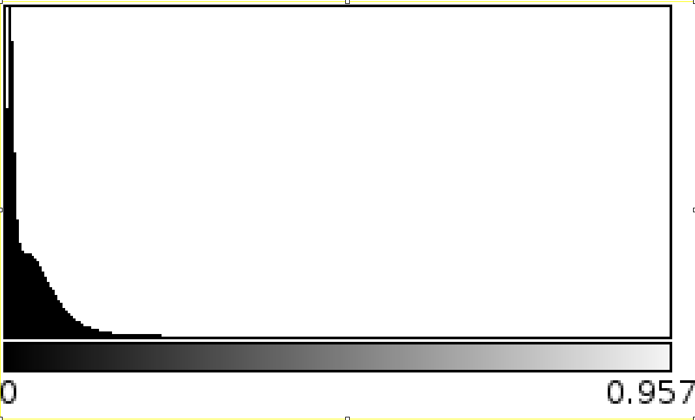
**Median10Transmittance:**
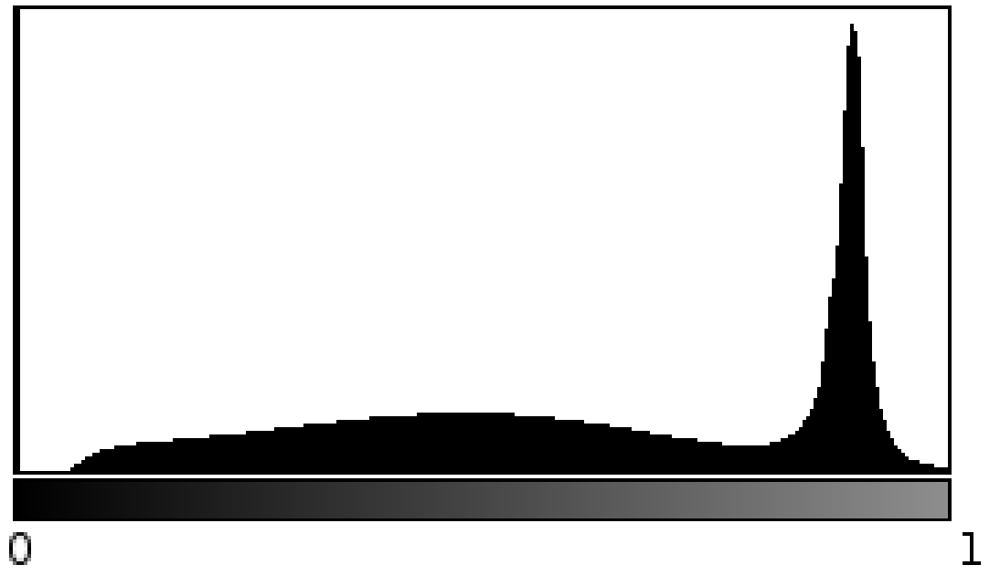

While the structure of those histograms is similar for complete measurements, this tool will fail if only a part
of a measurement is used as the input for **PLImg**. 
If a non median filtered NTransmittance is used as input, **PLImg** will generate the median10NTransmittance
automatically and save it as **[...]_Mask_[...].h5**. The dataset will match the original dataset of the input
files or is set by the `--dataset` parameter when starting the program.

After reading all files the parameters will be generated independently. Only `tTra` will depend on `tMin`.

### tMin
`tMin` or *minimal transmittance value* is considered as the average value of the transmittance within a connected region in the retardation with the highest values.
As the highest retardation values represent mostly white matter fibers, this can be used to get a first estimation of the white matter values in the transmittance.

To get the average transmittance value masks based on a difference value are generated. There, the connected components algorithm
is executed.

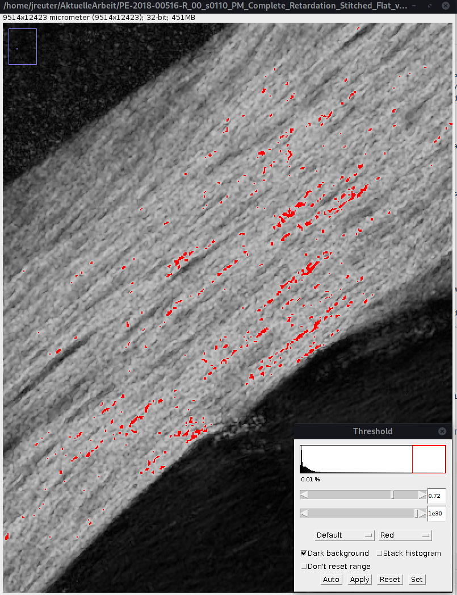

If the number of pixels in the connected region is large enough (0.01% of the number of pixels in the image)
the resulting mask will be used to calculate the mean transmittance value. Otherwise the difference will be reduced by one bin size $`1/256 = 0.00390625`$

### tMax

All other parameters rely on the same procedure to calculate the value. As seen in the histograms above,
both the transmittance and retardation show a somewhat smooth curve. Our interest is the point of maximum curvature
which separates the wanted regions from each other.

The maximum curvature is defined by the following formula:

$`\kappa = \frac{y^{''}}{(1+(y^{'})^2)^{3/2}}`$

To get both maxima and minima the first derivative is needed

$`\kappa^' = \frac{y^{'''}(1+(y^{'})^2) - 3y^{'}(y^{''}^2}{(1+(y^{'})^2)^{5/2}}`$

At each point where $`\kappa^{'}`$ reaches a value of 0 either a maxima or minima is located.

However a histogram does not represent a function. Therefore this formula has to be approximated.

$`f^{'}(x) = \frac{f(x+1) - f(x)}{h}`$

$`f^{''}(x) = \frac{f(x+1) - 2f(x) + f(x-1)}{h^2}`$

As we're not able to calculate the maxima of $`\kappa`$ directly we just choose the 
highest value of $`\kappa`$ for our point of maximum curvature.

`tMax` or *maximum transmittance value* separates the background of the transmittance from the tissue. 
The background is discernible by a clearly visible peak in the latter half of the histogram. The peak itself and all pixels with a value above the 
point of maximum curvature represent the background and will not be visible in the white / gray mask.

To find the maximum curvature a search interval between the second half of the histogram and absolute maximum value is selected.
In between this interval the next local minima in the left direction from the absolute maximum is selected as the left bound for the
maximum curvature. 

An example for the resulting mask can be seen below.

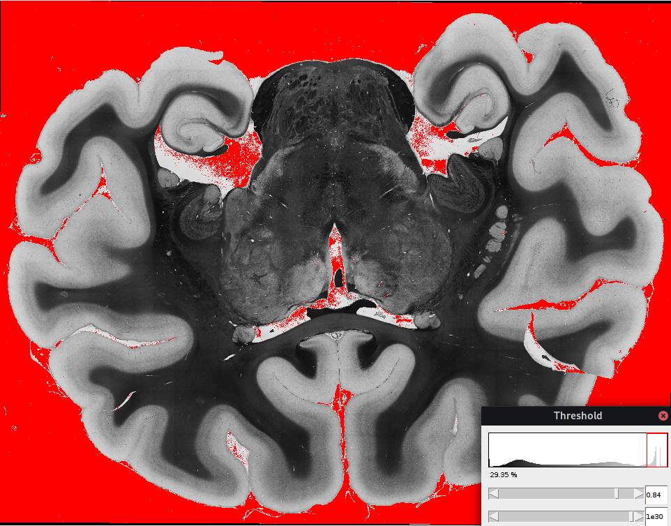

### tRet

After most of the necessary parameters are generated on the transmittance, one parameter in the retardation is needed to 
generate the desired white and gray fiber masks. The general procedure follows the algorithm used for `tTra`. However, to ensure that
the result is not influenced by small interferences or more than one peak, we change the algorithm a bit.

We start using a histogram of only 16 bins to get a first estimation of `tRet`. In each following iteration we increase the number of
bins by a factor of 2 up to 256 bins. In each iteration we take the last estimation and choose a interval around the last estimation
for our current one. This ensures that we do not end in a small dip which becomes visible with higher bin counts.

In addition if there's more than one peak in our interval, we start at the last peak. This is chosen because there might be a 
background peak resulting in erroneous parameters.

The resulting mask can be seen below. This mask generally gets most of the white substance but might still miss a few
areas. Those will be filled in combination with `tTra`.

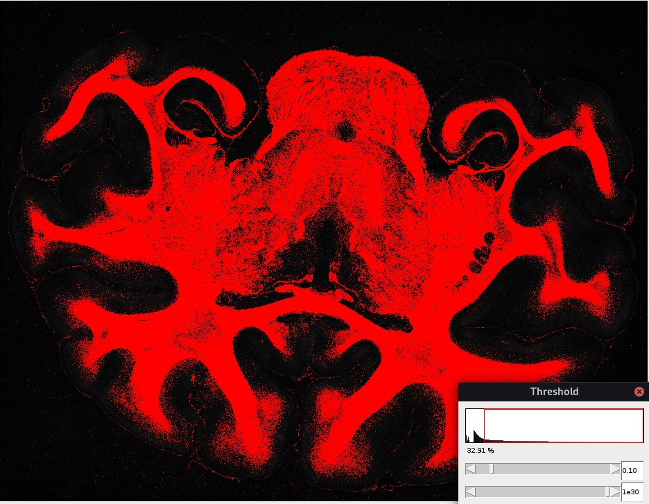

### tTra

While `tMin` is a good estimation in the transmittance some fine fibers might not be caught by simply using the mean
transmittance value. Therefore we use the curvature formula again to estimate a point which contains more finer fibers without
including too much to the gray matter. Our range will be limited by the next peak starting from `tMin`.
If not enough values are present to calculate $`\kappa`$ then `tMin` will be used as our value.

### White mask
After generating all of our parameters we can finally build our masks which separate the white and gray matter.
The formula for both masks as well as an example are shown below:

$`M_{white} = ((I_T < tTra) \wedge (I_T > 0)) \vee (r > sRet)`$
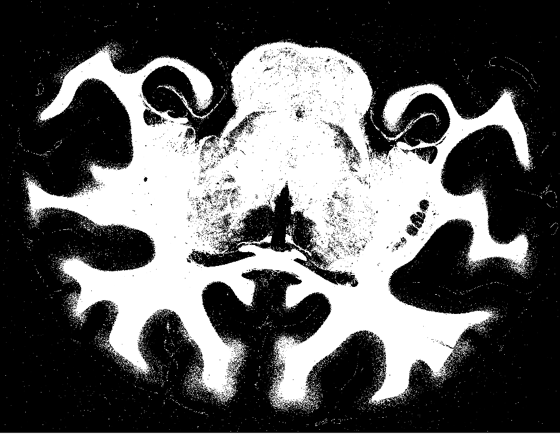

### Gray mask
$`M_{grey} = (I_T \geq tTra) \wedge (I_T \leq tMax) \wedge (r \leq tRet)`$
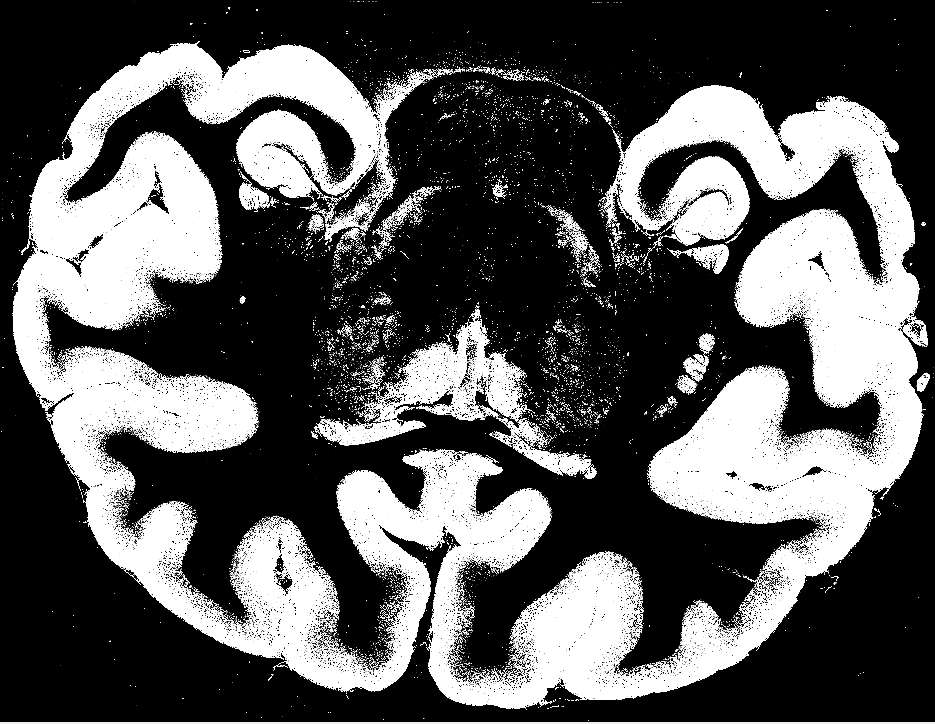

### Blurred mask
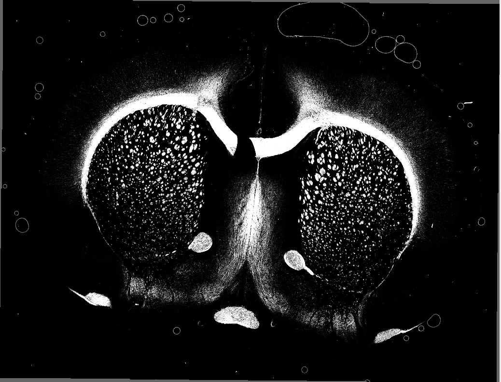

### No nerve fiber mask
The gray matter doesn't have as many fibers as the white matter. When calculating the inclination some parts might be
wrong because no fibers are present. This mask gives an esimation which parts of the gray matter might not have any fibers.
To archive this the mean and standard deviation of the background are used. Regions in the gray matter with a value below
mean + 2*stddev are considered as a region without any fibers.

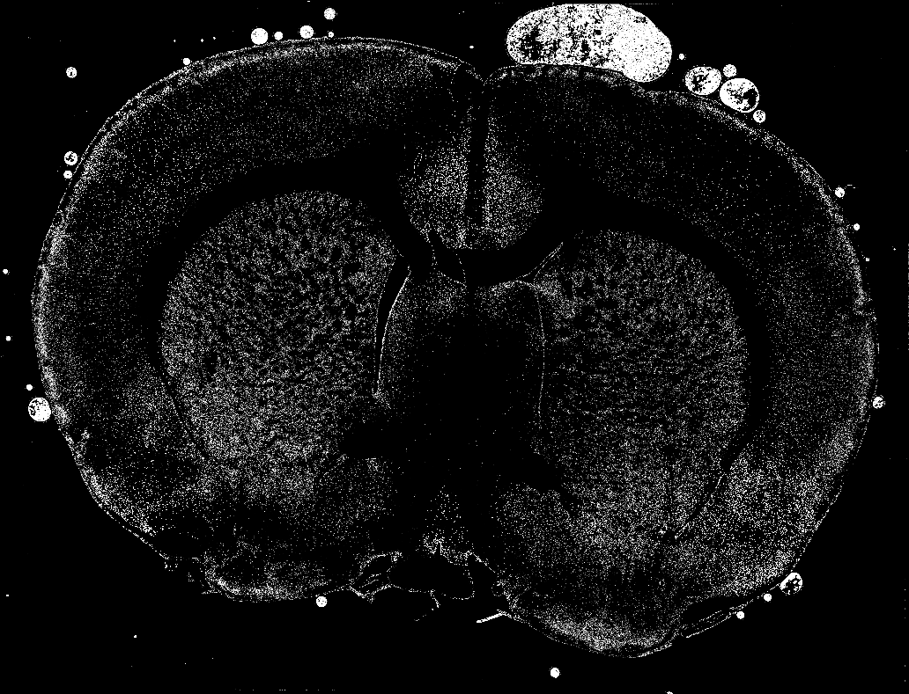

## Generation of the inclination

### im

### ic

### rmaxGray

### rmaxWhite

### Inclination

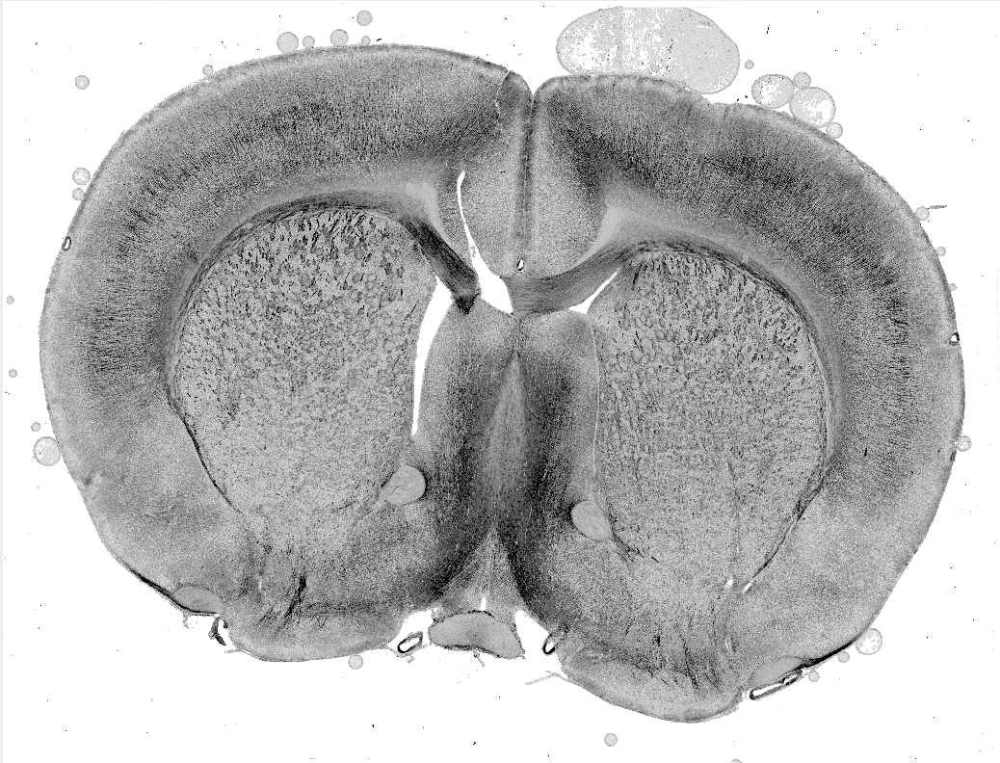

### Saturation map

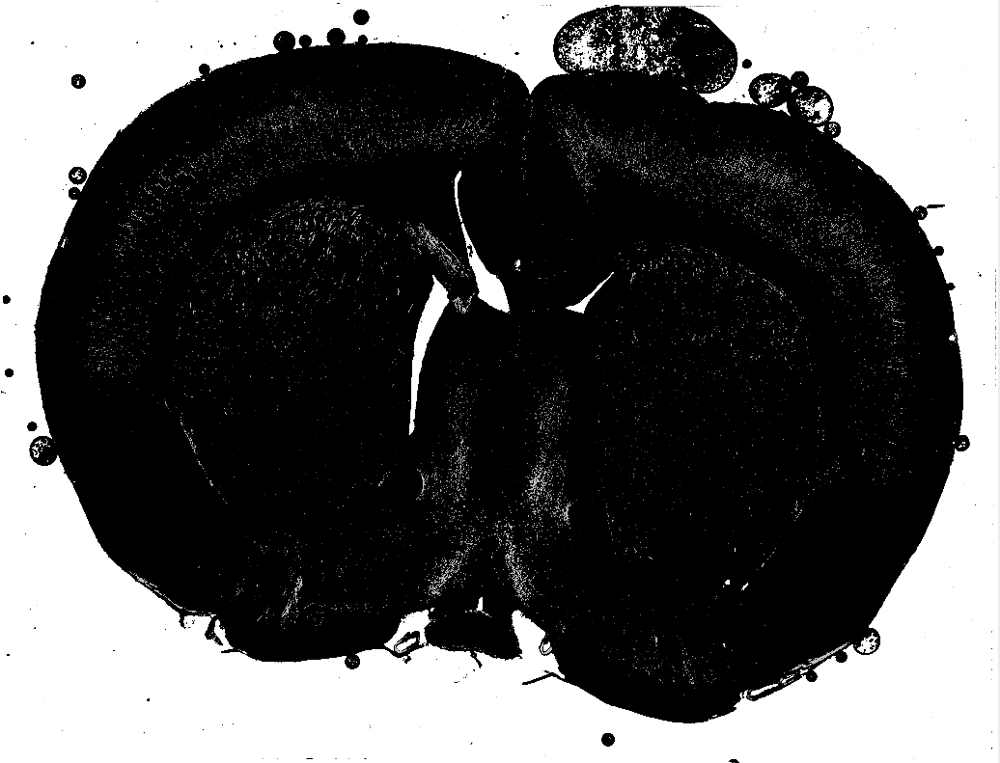